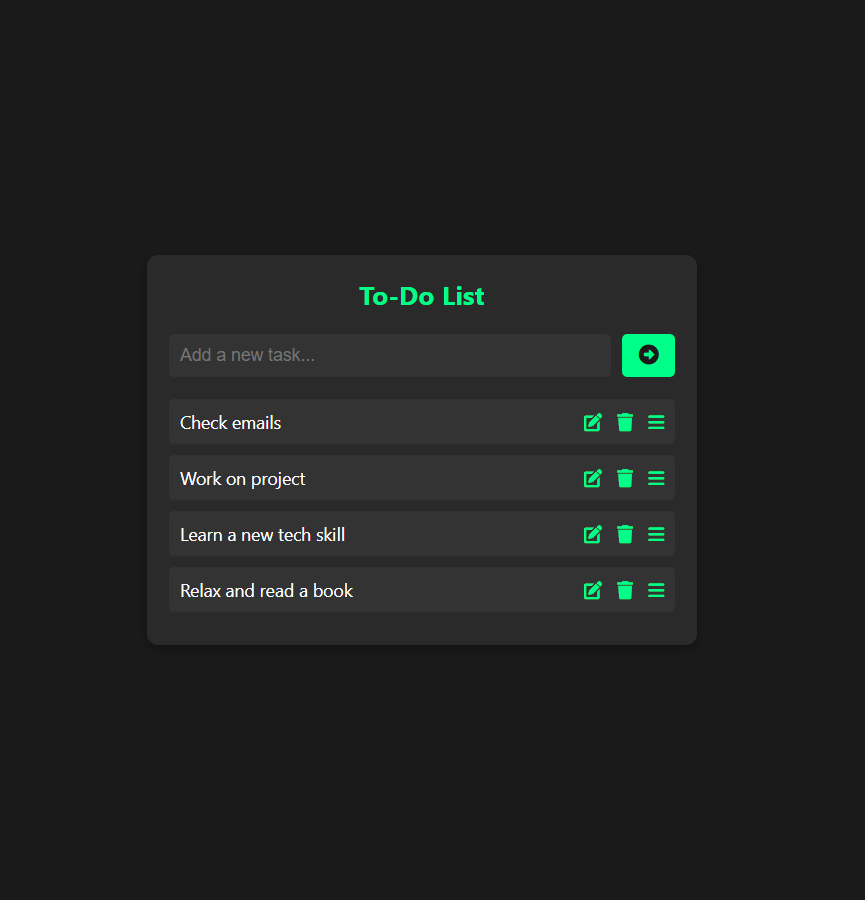

# **To-Do List**

A simple and responsive **To-Do List** application built with **HTML**, **CSS**, and **JavaScript**. The app allows you to add, edit, and delete tasks, along with drag-and-drop functionality for organizing tasks in the list.

## **Features**

- **Add new tasks**: Type in your tasks and click the add button.
- **Edit tasks**: Modify task text by clicking the edit button.
- **Delete tasks**: Remove tasks by clicking the delete button.
- **Drag-and-drop**: Reorder tasks using drag-and-drop functionality.
- **Responsive design**: The app adapts to different screen sizes for mobile and desktop views.

## **Technologies Used**

- **HTML**: Structure and layout of the app.
- **CSS**: Styling, animations, and responsive design.
- **JavaScript**: Task management, including adding, editing, deleting, and drag-and-drop functionality.

## **Demo**

Here’s a screenshot of the **To-Do List app**:

